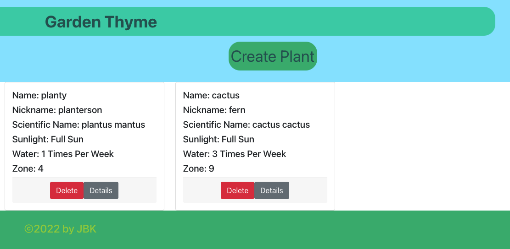
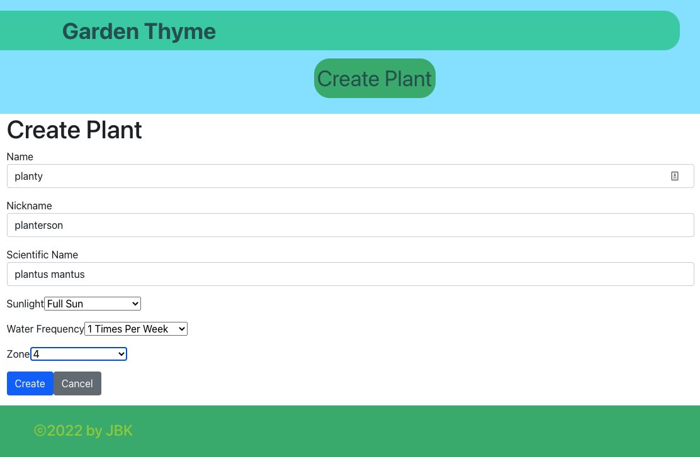

# Garden Thyme 

## Project Description

A fullstack Java application that provides nurseries and home gardeners the opportuntiy to keep track of plants and maintain notes as they grow. Microservice application built with two services and a registry. 

## Table of Contents

  - [Project Description](#project-description)
  - [Table of Contents](#table-of-contents)
  - [Visual Demonstration](#visual-demonstration)
  - [User Story](#user-story)
  - [Acceptance Criteria](#acceptance-criteria)
  - [Installation Instructions](#installation-instructions)
  - [Usage Information](#usage-information)
  - [Contributor Guidelines](#contributor-guidelines)
  - [Test Instructions](#test-instructions)
  - [License Info](#license-info)
  - [Questions?](#questions)

## Visual Demonstration
<h3 align="center" width="100%">
 

    

<h3 align="center" width="100%">

    

## User Story

    AS an avid gardener
    I WANT an application to track plants
    SO THAT I can understand what has been done and what needs to be done to have them thrive. 

## Acceptance Criteria

    GIVEN the Garden-Thyme home page
    THEN I am  presented a list of my current plants in my inventory
    WHEN I click on a plant
    THEN I am directed to the notes
    WHEN I make a note on the plant and click submit
    THEN I am able to see that note plus any others that currently exist for that plant.
    WHEN I click the create plant link
    THEN I am able to add a new plant to my inventory 
    WHEN I click delete plant
    THEN my plant is removed from my inventory
    WHEN I click on delete note
    THEN that note is removed from that plant
    

## Installation Instructions

From repository `git clone <url>` to clone down respository to local machine
`npm i` to install dependecies and packages to local machine

From MySQL workbench, run seeds found at root to seed the zone data. 
[Seed Data](https://github.com/JSheleg/garden-thyme/blob/troubleshootingMain2/grow_zone.sql)

Start individual backend servers in the following order

1. eureka-service-registry
2. grow-zone-service
3. plant-inventory-service

Finally start front end react server by starting from within the garden-thyme-frontend folder

run `npm start ` to start server

## Usage Information

This application serves as a way to keep track of plants that you currently have and ensure you keep proper notes for each plant 

## Contributor Guidelines

* [Submit bugs and feature requests](https://github.com/JSheleg/garden-thyme/issues).
* Review [source code changes](https://github.com/JSheleg/garden-thyme/pulls).

## Test Instructions

* For testing, run test suites found in the Test Folder

## License Info

Copyright 2022
The source code for the site is licensed under the MIT license and can be found at the link below:
[License Info Link](https://opensource.org/licenses/MIT)
      

## Questions?

* Find use on Github at:
    * [Katie Redford](https://github.com/katredford)
    * [Blaze Lim](https://github.com/blazelim)
    * [Jessica Sheleg](https://github.com/JSheleg)
